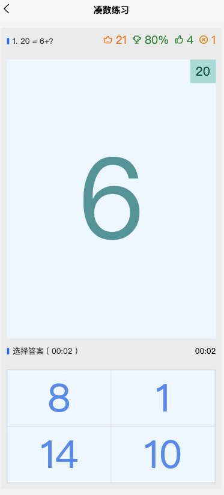

## 儿童训练助手
> 一个用来给娃练习基本能力的程序
### 为什么做这个程序
> 都说人脑是最牛的人工智能程序，那么就可以构建一个程序，让娃来不断练习，自己学习其中的规律了。
> 但学习是逆人性的，小孩更是如此。这个程序主要尝试通过提供一个简单、有趣的程序，让小孩可以更愿意学习

### 程序内容
准备逐步加入一下练习功能，计划涵盖语文、数学、英语等小孩需要学习的内容
目前完成情况：
* 用来练习加法的程序，里面添加了很多游戏元素来增加趣味性

### 研发相关
程序基于uniapp开发，可以跨平台

### 在线体验
[https://training.quickapi.cloud/](https://training.quickapi.cloud/)

